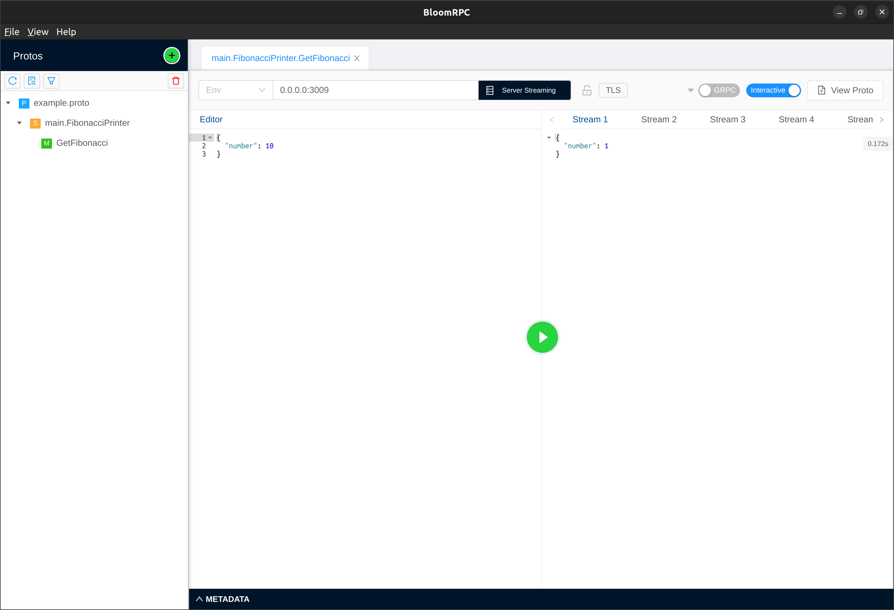

# Example: simple GRPC service

1. [`Manual`](#1-manual)
2. [`Docker compose`](#2-docker-compose)

## 1 Manual

You need to have [protobuf compiler](https://grpc.io/docs/protoc-installation/) and [BloomRPC](https://github.com/bloomrpc/bloomrpc) installed.

Create a new folder. Create a file named `example.proto` within the directory with the following content:
```protobuf
syntax = "proto3";

option go_package = "framework/example/grpc";

package main;

service FibonacciPrinter {
  rpc GetFibonacci(Number) returns (stream Number) {}
}

message Number {
  int32 number = 1;
}
```

Then execute the following command:
```bash
protoc --go_out=. --go_opt=paths=source_relative --go-grpc_out=. --go-grpc_opt=paths=source_relative example.proto 
```

Two files `example.pb.go` and `example_grpc.pb.go` should be generated

Create go.mod file inside with the following content:

``` go
module example

go 1.19

require (
	github.com/radianteam/framework v0.3.0
)
```

This file declares a module and the framework requirement.

Create a file named main.go and define the package inside:

``` go
package main
```

Create a main function and create an instance of the radian framework:

``` go
func main() {
	// create a new micrservice instance
	radian := framework.NewRadianMicroservice("example")
}
```

After the instance create a configuration for a gRPC service and create a new gRPC service that listens all adresses and port 3009. Name this service as you wish ("service_grpc" for example):

``` go
    // create a new gRPC worker
    grpcConfig := &grpc_radian.GrpcConfig{
		Listen: "0.0.0.0",
		Port:   3009,
	}
	grpcWorker := grpc_radian.NewGrpcServiceWorker("service_grpc", grpcConfig)
	grpcWorker.AddRegFunc(NewServicer())
```

Now implement gRPC server from generated contract:

``` go
type FibonacciServer struct {
	*grpc_contract.UnimplementedFibonacciPrinterServer

	adapters *worker.WorkerAdapters
}

func (*FibonacciServer) GetFibonacci(number *grpc_contract.Number, server grpc_contract.FibonacciPrinter_GetFibonacciServer) error {
	a := int32(0)
	b := int32(1)

	for i := int32(0); i < number.Number; i++ {
		if err := server.Send(&grpc_contract.Number{Number: b}); err != nil {
			return err
		}
		b += a
		a = b - a
	}

	return nil
}
```

Create a servicer for gRPC worker:

```go
// create servicer for worker
func NewServicer() func(s *grpc.Server, wc *worker.WorkerAdapters) {
	return func(s *grpc.Server, wc *worker.WorkerAdapters) {
		grpc_contract.RegisterFibonacciPrinterServer(s, &FibonacciServer{adapters: wc})
	}
}
```

Create and setup gRPC worker:

```go
// create a worker
grpcWorker := grpc_radian.NewGrpcServiceWorker("service_grpc", grpcConfig)
grpcWorker.AddRegFunc(NewServicer())
```

Add the gRPC worker to the main framework instance:

``` go
// append the worker to the framework
radian.AddWorker(grpcWorker)
```

Run the framework instance with the particular services:

``` go
// run the worker
radian.RunAll()
```

Now run the following command to download all requirements and prepare the application to start:

```
go mod tidy
```

Wait for the requirements download and then run the app:

```
go run main.go
```

Then run you need to call your gRPC server using BoomRPC. You need to import `example.proto` there, then specify amount of Fibonacci numbers that will be returned to the response:



The answer has been received! If something goes wrong check [`main.go`](main.go) file or play with it in containers.

<br>

## 2 Docker compose

WARNING: you must have docker and docker-compose installed on your system. Use [`this instruction`](https://docs.docker.com/compose/install/) if you don't have it.

### 1 Clone the repository

```
git clone https://github.com/radianteam/framework.git
```
```
cd framework
```

### 2 Goto this folder

```
cd example/grpc
```


### 3 Run the application

```
docker-compose up -d
```

### 4 Make a request using BloomRPC. 
You need to import `example.proto` there, then specify amount of Fibonacci numbers that will be returned to the response:


### 5 Enjoy!

And don't forget to stop the application :)

```
docker-compose down
```
